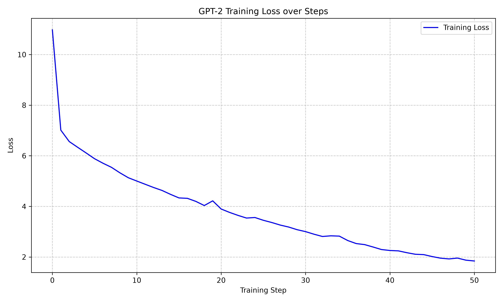

# GPT-2 from Scratch in PyTorch


A complete, ground-up implementation of OpenAI's GPT-2 (124M parameter) language model using PyTorch. This project encompasses the model architecture, a custom training loop, and an interactive inference script. 

## Features

- **GPT-2 Paper Implementation**: Implements the original GPT-2 model in PyTorch as described in the original paper.
- **Modernized Training Loop**: Uses modern industry practices such as AdamW optimizer, cosine learning rate decay and mixed precision to achieve faster training while also improving quality.
- **Autoregressive Inference**: Utilizes Top-K sampling and temperature scaling for text generation.

## Repository Structure

- `gpt2.py`: Contains the PyTorch implementation of the GPT-2 model.
- `train.py`: The training pipeline. Handles data loading, batching, loss calculation and backpropagation.
- `run.py`: The inference script. Loads trained weights and provides an interactive terminal for text generation.

## Getting Started

### Prerequisites

Ensure you have Python 3.8+ installed. A CUDA-compatible GPU is highly recommended for training.

```bash
git clone https://github.com/yourusername/gpt2-from-scratch.git
cd gpt2-from-scratch
pip install -r requirements.txt
```

(Optional) Use CUDA version of PyTorch to utilize GPU training/inference. At least 4 GB of VRAM is recommended.

```bash
pip uninstall torch
pip install torch --index-url https://download.pytorch.org/whl/cu126
```

### Training the Model

1. Use the default training data, or place your custom training data at `data/input.txt`.
2. Run the training script:

```bash
python train.py
```

The script will automatically detect CUDA if available, train the model, output metrics (Loss, Learning Rate, Tokens/sec), and save the final weights to `model.pth`.

### Text Generation

Once the model is trained and `model.pth` is generated, you can run inference on the model:

```bash
python run.py
```

## Tech Stack
- **Language:** Python
- **Libraries:** PyTorch, Tiktoken
- **Paper:** [Language Models are Unsupervised Multitask Learners](https://cdn.openai.com/better-language-models/language_models_are_unsupervised_multitask_learners.pdf)
- **Dataset:** [Tiny Shakespeare](https://raw.githubusercontent.com/karpathy/char-rnn/master/data/tinyshakespeare/input.txt)

## Technical Details

- **Parameters**: ~124 Million
- **Context Window (Block Size)**: 1024 tokens
- **Vocab Size**: 50,257 (50,000 BPE merges + 256 bytes + 1 end of text token)
- **Layers**: 12
- **Attention Heads**: 12
- **Embedding Dimension**: 768

These are the default values used for 124M GPT-2, but all of them modifiable.

## Results

- Achieved `1.8415` Cross Entropy loss.
- Trained for `500` steps, which equals to `12,000` iterations over the dataset.
- Training took ~1 hour on an Nvidia RTX 5080 Mobile GPU with 16 GB VRAM and CUDA enabled.



## Acknowledgements
Special thanks to [Andrej Karpathy](https://karpathy.ai/) for his phenomenal educational content on Large Language Models, which heavily inspired the architecture and training methodologies used in this project.